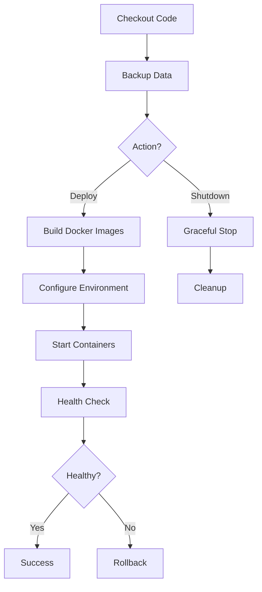

# 🚀 Jenkins CI/CD Directory

This directory contains all Jenkins pipeline configurations and deployment scripts for the UIT RO Transport Request application.

## 📂 Structure

```
jenkins/
├── jenkins-pipeline-complete.groovy   # Main deployment pipeline
├── jenkins-shutdown-pipeline.groovy   # Shutdown/cleanup pipeline
└── shutdown.sh                        # Shutdown script
```

## 🔄 Pipelines

### 1. Complete Pipeline (`jenkins-pipeline-complete.groovy`)

**Primary deployment pipeline** - handles full application lifecycle.

**Features:**
- ✅ Git checkout with branch selection
- ✅ Docker image building (with/without cache)
- ✅ SSL certificate management
- ✅ Token Manager configuration
- ✅ Data backup/restore
- ✅ Container orchestration
- ✅ Health checks
- ✅ Automatic rollback on failure

**Parameters:**
- `BRANCH` - Git branch to deploy (default: `dev`)
- `FORCE_REBUILD` - Force rebuild without Docker cache
- `ACTION` - Choose: `deploy` or `shutdown`
- `USE_CUSTOM_CERTS` - Upload new SSL certificates
- `USE_TOKEN_MANAGER` - Enable automatic token refresh (recommended)
- `RPA_BOT_PASSWORD` - Password for Token Manager (from credentials)
- `MANUAL_SHAREPOINT_TOKEN` - Legacy manual token (fallback)
- `DEBUG_SECRET_KEY` - Optional debug mode access

**Usage:**
```
Jenkins → transport-request-form-app job
→ Build with Parameters
→ Select ACTION=deploy, configure params
→ Build
```

**Jenkins Job Configuration:**
1. Pipeline Definition: Pipeline script from SCM
2. SCM: Git
3. Repository URL: `https://github.com/your-org/transport-request-form-app.git`
4. Script Path: `jenkins/jenkins-pipeline-complete.groovy`
5. Credentials: `c5526276-84a5-4328-9968-b0ff64ea094f` (git)
6. Credentials: `webapp-transport-app` (RPA password)

### 2. Shutdown Pipeline (`jenkins-shutdown-pipeline.groovy`)

**Graceful shutdown pipeline** - stops application safely.

**Features:**
- ✅ Data backup before shutdown
- ✅ Graceful container stop
- ✅ Resource cleanup
- ✅ Log preservation

**Usage:**
```
Jenkins → transport-request-form-app job
→ Build with Parameters
→ Select ACTION=shutdown
→ Build
```

### 3. Shutdown Script (`shutdown.sh`)

**Manual shutdown script** for emergency/maintenance use.

**Features:**
```bash
#!/bin/bash
# Stops Docker containers gracefully
docker compose -f docker-compose.yaml down
```

**Usage:**
```bash
# On Jenkins agent (WSL-VM16)
cd /path/to/transport-request-form-app
./jenkins/shutdown.sh
```

## 🔐 Required Credentials

### 1. Git Access
- **ID**: `c5526276-84a5-4328-9968-b0ff64ea094f`
- **Type**: Username with password
- **Scope**: Global
- **Used for**: Cloning repository

### 2. RPA Bot Password
- **ID**: `webapp-transport-app`
- **Type**: Username with password
- **Username**: `transport-app@yourdomain.com`
- **Used for**: Token Manager automatic token fetching

## 📋 Pipeline Flow



## 🛠️ Development

### Testing Pipeline Locally

```groovy
// Validate syntax
jenkins-linter jenkins/jenkins-pipeline-complete.groovy

// Test in Jenkins Sandbox
// → Create test job with same pipeline
// → Use test branch
```

### Modifying Pipeline

1. **Clone repository**
   ```bash
   git clone <repo-url>
   cd jenkins/
   ```

2. **Edit pipeline**
   ```bash
   code jenkins-pipeline-complete.groovy
   ```

3. **Commit changes**
   ```bash
   git add jenkins/
   git commit -m "feat: update pipeline"
   git push origin dev
   ```

4. **Test in Jenkins**
   - Jenkins will auto-detect changes
   - Run test deployment

## 🔧 Troubleshooting

### Issue: "Permission denied" on shutdown.sh
```bash
chmod +x jenkins/shutdown.sh
```

### Issue: "Credentials not found"
```
→ Jenkins → Manage Jenkins → Credentials
→ Verify IDs match pipeline:
   - c5526276-84a5-4328-9968-b0ff64ea094f (git)
   - webapp-transport-app (RPA password)
```

### Issue: Pipeline fails at Docker build
```groovy
// Check Docker on agent
sh 'docker version'
sh 'docker compose version'

// Force clean rebuild
params.FORCE_REBUILD = true
```

### Issue: Health check fails
```bash
# Check container logs
docker compose logs backend
docker compose logs frontend

# Check network
docker compose ps
curl http://localhost:8010/
```

## 📊 Monitoring

### Pipeline Logs
- Jenkins → transport-request-form-app → Build History
- Click build number → Console Output

### Application Logs
```bash
# On Jenkins agent
cd /path/to/transport-request-form-app
docker compose logs -f backend
docker compose logs -f frontend
```

### Health Endpoints
- Backend: http://localhost:8010/
- Frontend: http://localhost:8011/

## 🎯 Best Practices

1. **Always test on `dev` branch first**
2. **Use Token Manager** (don't use manual tokens)
3. **Backup data** before major changes
4. **Monitor first deployment** after pipeline changes
5. **Keep credentials secure** (never commit to git)

## 📚 Related Documentation

- Main README: `../README.md`
- Developer Guide: `../DEVELOPER.md`
- Testing: `../TESTING.md`
- Deployment: `../DEPLOYMENT.md` (if exists)
